# Video_Highlight_Generation_with_Chat_Scroll_Speed

Official Python Implementation | [Paper](https://drive.google.com/file/d/18Hh8vuDFtgTo_s6mk8hBnYr0F7vMtkua/view?usp=share_link)

**[Jaechan Jo](mailto:jjc12223a@gmail.com)**

Multi Media System Lab, Sogang AI Research.

## Sample Results
### Overview
A highlight generation method for personal broadcasting by chatting text scroll speed using scene text detection, [CRAFT](https://github.com/clovaai/CRAFT-pytorch)

- Graph

  - 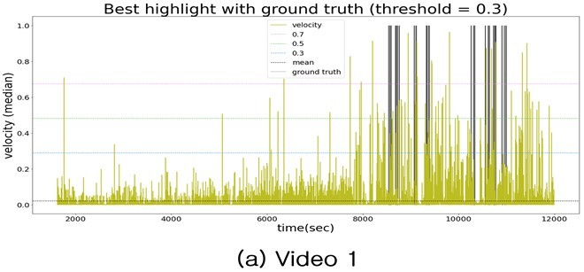
  - 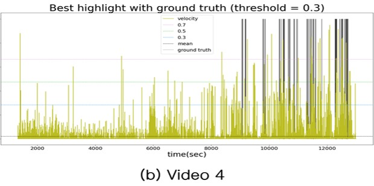

- Table
  - Optimal Parameter(Median, threshold 0.3)

    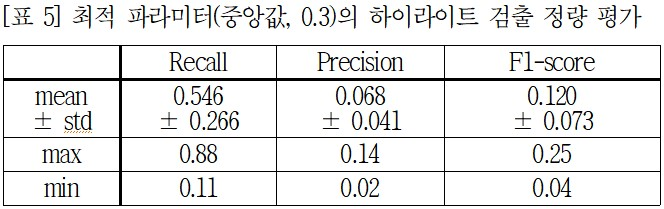
    
  
## Method

### 0. Dataset

  - Youtube [Sea Story](https://www.youtube.com/@AISea), Long Sea Story [MK02](https://www.youtube.com/channel/UCqHtUNpPZci7VzmiQVMpGJw), [MK03](https://www.youtube.com/channel/UCG5Cx7Bjr29gQ-uq4nFBRcw)
    
    
    
  - Table of Dataset Summary
  
    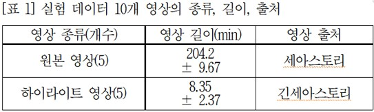
    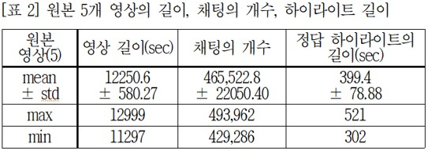

### 1. Scene Text Detection

  - Naver Clova AI [CRAFT](https://github.com/clovaai/CRAFT-pytorch), General Model

    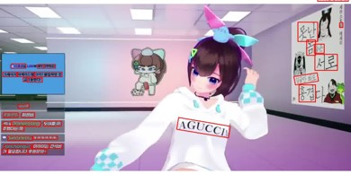
    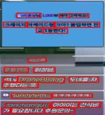

### 2. Coordinate Transformation

  - Convert text area Bounding Box coordinates to (Width, Time, *Normalized_y) form
  
    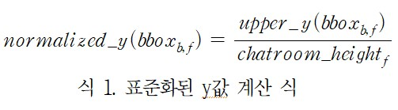

### 3. Chat Scroll Speed

  - (distance traveled in a specific chat area) / (time between frames)
  
    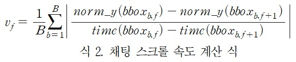
  
  * Q. How to distinguish specific chat text area?
  
    - chat text area ID is the `width` of the bounding box
    
      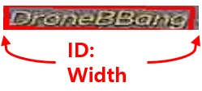
      
    - To distinguish between overlapping widths, the before and after boxes are also checked
    
      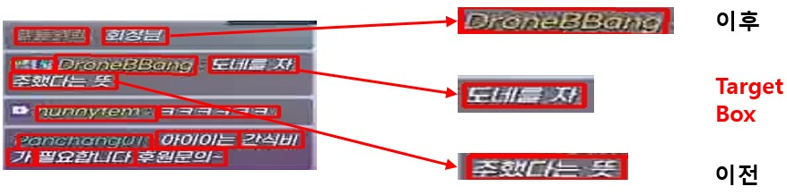
      

## Setup

### Packages

  - numpy
  - pandas
  - matplotlib
  - PIL
  - scipy
  - iteration_utilities

```
$ cat requirements.txt | while read PACKAGE; do pip install "$PACKAGE"; done
```

 > **install error**를 무시하고 설치합니다.

